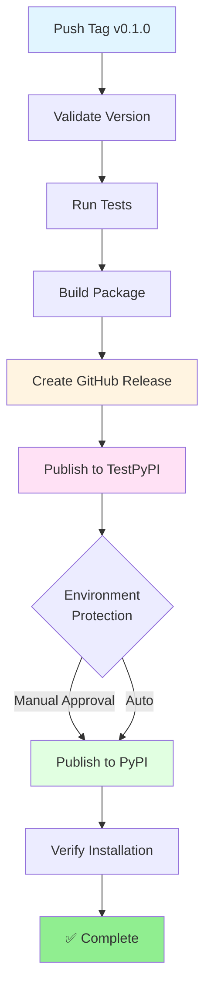

# Configuração do PyPI Trusted Publishing

O **Trusted Publishing** é o método mais seguro e recomendado para publicar pacotes Python no PyPI a partir do GitHub Actions. Ele elimina a necessidade de criar e gerenciar tokens API manualmente.

## 🔐 Por que usar Trusted Publishing?

✅ **Mais Seguro**: Não requer armazenar tokens
✅ **Mais Simples**: Configuração automática via OIDC
✅ **Recomendado**: Método oficial do PyPI
✅ **Sem Rotação**: Não precisa renovar tokens

## 📝 Como Configurar

### 1. Configurar no PyPI

#### Para Novo Projeto (Primeiro Release):

1. Acesse: https://pypi.org/manage/account/publishing/
2. Clique em **"Add a new publisher"**
3. Preencha:
   ```
   PyPI Project Name: oidc_pure
   Owner: Pacalexandre
   Repository name: oidc_pure
   Workflow name: release-publish.yml
   Environment name: pypi  (opcional, mas recomendado)
   ```
4. Clique em **"Add"**

#### Para Projeto Existente:

1. Acesse: https://pypi.org/manage/project/oidc_pure/settings/publishing/
2. Siga os mesmos passos acima

### 2. Configurar no TestPyPI

Repita o processo em: https://test.pypi.org/manage/account/publishing/

```
PyPI Project Name: oidc_pure
Owner: Pacalexandre
Repository name: oidc_pure
Workflow name: release-publish.yml
Environment name: testpypi  (opcional)
```

### 3. Atualizar Workflow (Já Configurado)

O workflow `release-publish.yml` já está configurado para usar Trusted Publishing:

```yaml
permissions:
  contents: write
  id-token: write  # ← Isso habilita o Trusted Publishing

jobs:
  publish-to-pypi:
    steps:
      - uses: pypa/gh-action-pypi-publish@release/v1
        # Sem 'password' ou 'token' - usa Trusted Publishing automaticamente!
```

## 🚀 Usando Trusted Publishing vs API Tokens

### Método 1: Trusted Publishing (Recomendado) ✅

**Configuração**:
- Configure o publisher no PyPI (uma vez)
- Workflow usa `id-token: write` permission
- Sem secrets necessários

**Workflow**:
```yaml
permissions:
  id-token: write

jobs:
  publish:
    steps:
      - uses: pypa/gh-action-pypi-publish@release/v1
        # Autenticação automática via OIDC!
```

### Método 2: API Tokens (Legado)

**Configuração**:
- Criar token no PyPI
- Adicionar aos GitHub Secrets
- Gerenciar rotação de tokens

**Workflow**:
```yaml
jobs:
  publish:
    steps:
      - uses: pypa/gh-action-pypi-publish@release/v1
        with:
          password: ${{ secrets.PYPI_API_TOKEN }}
```

## 🔄 Migração de API Tokens para Trusted Publishing

Se você já usa tokens API e quer migrar:

1. Configure o Trusted Publishing no PyPI (passos acima)
2. Remova a linha `password:` do workflow
3. Mantenha `id-token: write` permission
4. Faça um teste
5. Revogue os tokens API antigos quando confirmar que funciona

## ⚙️ Configuração Avançada: Environments

Para melhor controle (especialmente em PyPI produção):

### Criar Environment no GitHub:

1. Acesse: `Settings` → `Environments` → `New environment`
2. Nome: `pypi`
3. Configure **Protection Rules**:
   - ✅ Required reviewers: Adicione você mesmo
   - ✅ Wait timer: 5 minutos (tempo para review antes de publicar)
4. Configure **Deployment branches**: Apenas tags `v*`

Benefícios:
- Aprovação manual antes de publicar no PyPI
- Histórico de deployments
- Rollback mais fácil
- Melhor auditoria

## 🧪 Testando a Configuração

### Teste 1: Validar Configuração Local
```bash
./release.sh --check
```

### Teste 2: Criar Tag de Teste (sem push)
```bash
./release.sh 0.1.0
# Verifica se a tag é criada corretamente sem triggar workflow
git tag -d v0.1.0  # Deletar depois
```

### Teste 3: Release Real em TestPyPI
```bash
# Use uma versão de teste
./release.sh 0.1.0-test1 --push
```

Monitore em: https://github.com/Pacalexandre/oidc_pure/actions

## 📊 Workflow Flow



## 🛡️ Segurança

### Vantagens do Trusted Publishing:

1. **Sem Vazamento de Tokens**: Não há tokens para vazar
2. **Sem Rotação**: Não precisa renovar tokens periodicamente
3. **Auditoria**: Logs completos no PyPI de onde vieram os uploads
4. **Escopo Limitado**: Apenas o workflow específico pode publicar
5. **Revogação Fácil**: Remove o publisher no PyPI

### Best Practices:

- ✅ Use environments com proteções
- ✅ Limite quem pode criar tags protegidas
- ✅ Configure branch protection rules
- ✅ Habilite 2FA no GitHub e PyPI
- ✅ Revise logs de deployment regularmente

## 📖 Documentação Oficial

- [PyPI Trusted Publishing Guide](https://docs.pypi.org/trusted-publishers/)
- [GitHub Actions - Publishing with OIDC](https://docs.github.com/en/actions/deployment/security-hardening-your-deployments/about-security-hardening-with-openid-connect)
- [pypa/gh-action-pypi-publish](https://github.com/pypa/gh-action-pypi-publish)

## ❓ FAQ

### Como testar sem publicar no PyPI real?

Use o TestPyPI primeiro:
1. Crie uma tag com sufixo de teste: `v0.1.0-test1`
2. O workflow publicará no TestPyPI
3. Se o environment estiver configurado, o PyPI requer aprovação manual

### Posso fazer rollback de uma release?

- ❌ Não é possível deletar uma versão do PyPI
- ✅ Você pode marcar como "yanked" (não recomendada para instalação)
- ✅ Publique uma nova versão corrigida

### O que acontece se o workflow falhar?

- GitHub Release pode ser editado ou deletado
- TestPyPI permite republicar (não é crítico)
- PyPI **NÃO permite** republicar a mesma versão
- Solução: Incremente a versão e republique

### Preciso ainda dos tokens API?

- ❌ Não, se usar Trusted Publishing (recomendado)
- ✅ Pode remover os secrets `PYPI_API_TOKEN` depois que confirmar que funciona
- ℹ️ Mantenha os tokens como backup até confirmar que o Trusted Publishing funciona

---

**Última Atualização**: Fevereiro 2026  
**Autor**: Paulo Alexandre
