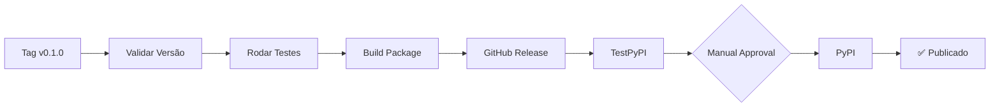

# GitHub Workflows - Guia de Configuração

Este projeto usa GitHub Actions para automação de CI/CD, incluindo testes, releases e publicação no PyPI.

## 📋 Workflows Disponíveis

### 1. **CI - Tests and Validation** (`ci.yml`)

**Trigger**: Push e Pull Requests para `main` e `develop`

**Jobs**:
- ✅ Lint e Format Check (ruff)
- ✅ Testes em Python 3.12 e 3.13
- ✅ Cobertura de código (enviada para Codecov)
- ✅ Build do pacote
- ✅ Validação com twine

### 2. **Security Audit** (`security.yml`)

**Trigger**: Push, PRs, agendamento semanal, manual

**Jobs**:
- ✅ Auditoria de segurança com pip-audit, safety e bandit
- ✅ Upload de relatórios em caso de falha
- ✅ Comentários automáticos em PRs

### 3. **Release and Publish** (`release-publish.yml`)

**Trigger**: 
- Tags no formato `v*.*.*` (ex: `v0.1.0`)
- Manual via workflow_dispatch

**Jobs**:
1. ✅ Validação da versão
2. ✅ Build e testes completos
3. ✅ Criação de GitHub Release
4. ✅ Publicação no TestPyPI
5. ✅ Publicação no PyPI
6. ✅ Verificação da instalação

---

## 🔧 Configuração Inicial

### 1. Configurar Secrets no GitHub

Acesse: `Settings` → `Secrets and variables` → `Actions`

#### Secrets Necessários:

```bash
# Para publicação no TestPyPI
TEST_PYPI_API_TOKEN=pypi-XXXXXXXX

# Para publicação no PyPI (produção)
PYPI_API_TOKEN=pypi-XXXXXXXX

# Opcional: Para enviar cobertura ao Codecov
CODECOV_TOKEN=XXXXXXXX
```

### 2. Criar Tokens de API

#### TestPyPI (Recomendado fazer primeiro):
1. Acesse: https://test.pypi.org/manage/account/token/
2. Crie um token com escopo para o projeto `oidc_pure`
3. Copie o token (formato: `pypi-XXXXXXXX`)
4. Adicione como `TEST_PYPI_API_TOKEN` nos secrets

#### PyPI (Produção):
1. Acesse: https://pypi.org/manage/account/token/
2. Crie um token com escopo para o projeto `oidc_pure`
3. Copie o token (formato: `pypi-XXXXXXXX`)
4. Adicione como `PYPI_API_TOKEN` nos secrets

#### Codecov (Opcional):
1. Acesse: https://codecov.io/
2. Conecte seu repositório
3. Copie o token de upload
4. Adicione como `CODECOV_TOKEN` nos secrets

### 3. Configurar Environments (Opcional mas Recomendado)

Para ter melhor controle sobre deployments:

1. Acesse: `Settings` → `Environments`

2. Crie dois environments:

   **testpypi**:
   - Sem proteções (pode publicar automaticamente)
   - URL: `https://test.pypi.org/project/oidc_pure/`
   - Secret: `TEST_PYPI_API_TOKEN`

   **pypi**:
   - **Protection rules**:
     - ✅ Required reviewers (adicione você mesmo)
     - ✅ Wait timer: 5 minutos (tempo para review)
   - URL: `https://pypi.org/project/oidc_pure/`
   - Secret: `PYPI_API_TOKEN`

---

## 🚀 Como Fazer um Release

### Método 1: Via Tag (Recomendado)

```bash
# 1. Atualize a versão no pyproject.toml
vim pyproject.toml  # Altere version = "0.1.0" para nova versão

# 2. Commit as mudanças
git add pyproject.toml
git commit -m "chore: bump version to 0.2.0"

# 3. Crie uma tag
git tag -a v0.2.0 -m "Release v0.2.0"

# 4. Push da tag (isso irá triggar o workflow)
git push origin v0.2.0
```

### Método 2: Dispatch Manual

1. Acesse: `Actions` → `Release and Publish to PyPI`
2. Clique em `Run workflow`
3. Digite a versão (ex: `0.2.0`)
4. Clique em `Run workflow`

⚠️ **Importante**: A versão deve estar correta no `pyproject.toml`!

---

## 📦 Fluxo de Publicação



### Ordem de Execução:

1. **Validação**: Verifica se a versão da tag corresponde ao `pyproject.toml`
2. **Testes**: Roda todos os testes e auditorias de segurança
3. **Build**: Constrói o pacote wheel e sdist
4. **GitHub Release**: Cria release no GitHub com changelog automático
5. **TestPyPI**: Publica no ambiente de testes
6. **Aprovação Manual** (se configurado): Aguarda aprovação para produção
7. **PyPI**: Publica na versão de produção
8. **Verificação**: Testa a instalação do PyPI

---

## 🧪 Testando Antes de Publicar

### Teste Local:

```bash
# Build local
./build_package.sh

# Instalar localmente
pip install dist/*.whl

# Testar
python -c "import oidc_pure; print(oidc_pure.__version__)"
```

### Teste no TestPyPI (Manual):

```bash
# Publicar no TestPyPI
./publish_to_pypi.sh testpypi

# Instalar do TestPyPI
pip install --index-url https://test.pypi.org/simple/ --extra-index-url https://pypi.org/simple/ oidc_pure
```

---

## 🔍 Monitoramento

### Verificar Status dos Workflows:

- **Actions Tab**: https://github.com/Pacalexandre/oidc_pure/actions
- **Releases**: https://github.com/Pacalexandre/oidc_pure/releases

### Verificar Publicações:

- **PyPI**: https://pypi.org/project/oidc_pure/
- **TestPyPI**: https://test.pypi.org/project/oidc_pure/

### Badges (Adicione ao README.md):

```markdown


[](https://codecov.io/gh/Pacalexandre/oidc_pure)
```

---

## 🐛 Troubleshooting

### Problema: "Version mismatch"

**Solução**: Certifique-se de que a versão no `pyproject.toml` corresponde à tag.

```bash
# Verificar versão no pyproject.toml
grep '^version = ' pyproject.toml

# A tag deve ter o mesmo número (com 'v' no início)
git tag v0.1.0
```

### Problema: "Authentication error" no PyPI

**Solução**: 
1. Verifique se o token está correto
2. Certifique-se de que o token tem escopo para o projeto
3. Verifique se o secret está configurado corretamente no GitHub

### Problema: "Package already exists" no PyPI

**Solução**: 
- PyPI não permite republicar uma versão existente
- Incremente a versão no `pyproject.toml`
- Crie uma nova tag

### Problema: Workflow não trigga

**Solução**:
```bash
# Certifique-se de fazer push da tag
git push origin v0.1.0

# Verifique se a tag foi criada
git tag -l

# Verifique se o workflow existe
ls -la .github/workflows/
```

---

## 📚 Recursos Adicionais

- [GitHub Actions Documentation](https://docs.github.com/en/actions)
- [PyPI Publishing Guide](https://packaging.python.org/en/latest/guides/publishing-package-distribution-releases-using-github-actions-ci-cd-workflows/)
- [Trusted Publishing](https://docs.pypi.org/trusted-publishers/)
- [Semantic Versioning](https://semver.org/)

---

## ✅ Checklist para Primeiro Release

- [ ] Configurar secrets no GitHub (`PYPI_API_TOKEN`, `TEST_PYPI_API_TOKEN`)
- [ ] Configurar environments (opcional mas recomendado)
- [ ] Testar build local: `./build_package.sh`
- [ ] Rodar testes: `pytest`
- [ ] Atualizar versão no `pyproject.toml`
- [ ] Atualizar `README.md` e `CHANGELOG.md`
- [ ] Criar e push da tag: `git tag v0.1.0 && git push origin v0.1.0`
- [ ] Monitorar workflow no GitHub Actions
- [ ] Verificar release no GitHub
- [ ] Verificar publicação no TestPyPI
- [ ] Aprovar publicação no PyPI (se configurado)
- [ ] Testar instalação: `pip install oidc_pure`
- [ ] Adicionar badges ao README.md

---

**Autor**: Paulo Alexandre  
**Licença**: MIT  
**Repositório**: https://github.com/Pacalexandre/oidc_pure
